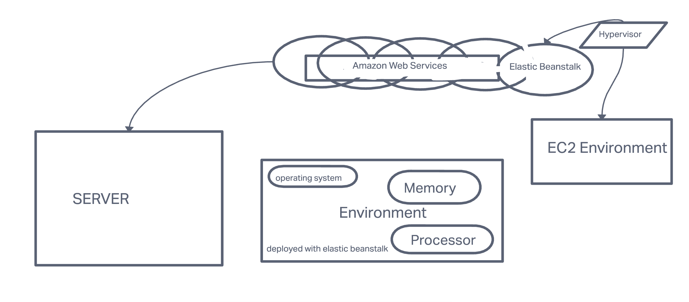

# cloud-server
## Lab 16 AWS Cloud-Server
### Author: Michael Campbell

#### Description: 

### Task 1:

-Create a new environment, using Elastic Beanstalk from the AWS Control Panel (GUI)
Manually deploy your application to this environment by uploading a .zip file

### Task 2:

- Using the same server, create a new environment using Elastic Beanstalk from your terminal
Manually deploy your application to this environment by using eb deploy

### Setup
**Dependencies:**

#### UML
(created with [invisionApp](https://invisionapp.com/) )

- Links to both deployed servers (GUI deploy and CLI deploy)
[GUI Deploy](Lab16cloudserver-env.eba-65es2wrz.us-west-1.elasticbeanstalk.com)
[CLI Deploy]()

